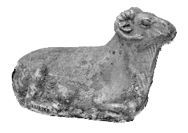
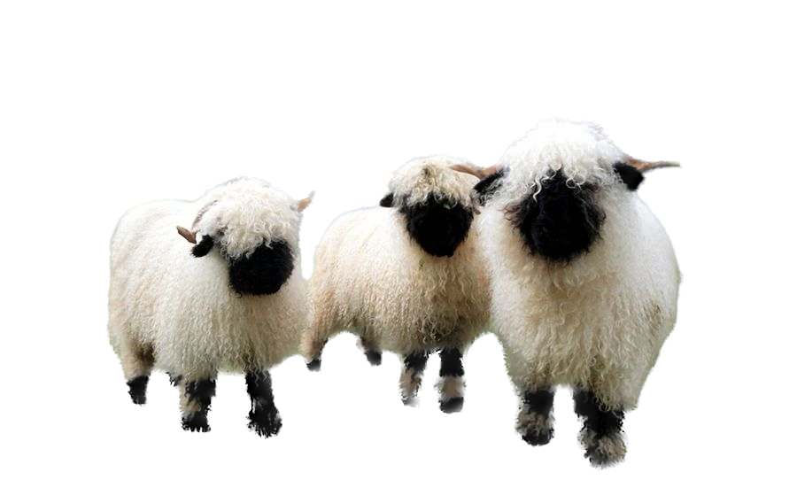

# Sheep 🐑
## The Symbolism of Sheep

---
****
_______

Sheep have long held symbolic significance across cultures. Representing qualities such as innocence, humility, and community, they remind us of the deeper connections we 
share with the natural world.

---
****
_______

## Unity in Grazing

### Guardians of the Countryside

#### Fascinating Tidbit

---
****
_______

Sheep possess a unique ability to recognize faces, both human and ovine. Their social intelligence enhances their interactions and strengthens their bonds.

